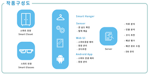
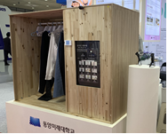

## **AI 기반 스마트 옷장**

#### 작품 개요
  매일 아침 어떤 옷을 입을지 고민하는 시간을 줄여주고, 집에 있는 옷을 효율적으로 관리하여 사용자의 *편의성*을 높이는 데에 목적을 두고있다. 
  ***
##### 작품 구성도
  
  ***
  
• 개발 소프트웨어 : node.js, arduino, python , mysql

• 기능설명 :
- kakao vision 서비스와, TensorFlow를 통해 학습시킨 모델을 가지고 
       옷의 세부사항 자동 분류하여 옷 등록
     - 저장된 분석결과를 바탕으로 코디를 추천한다.
     - kakao vision 서비스와, TensorFlow를 통해 학습시킨 모델을 가지고 옷의 세부사항을
       자동으로 분류 한다.
     - 사용자의 옷을 가지고 사용자 선호와 날씨를 고려하여 전체 코디를 추천한다.
     - 스마트안경으로 찍은 옷 이미지나, 가지고 있는 개별 옷에 어울리는 상의나 하의를 
       추천한다.
     - 자주 입는 옷들의 데이터 기반 사용자의 선호 스타일 분석한다.
     - RFID 태그와 리더기와 네오 픽셀을 이용하여 옷의 위치를 시각적으로 나타낸다.
     - 사용자 편의성 증대 ( 날씨 정보, 캘린더 )
     ***
   
     ***
   
###### 백엔드 기능 설명
  
 1. 개발 언어: node.js, python
    * 프레임워크: express
    
 2. 데이터베이스: mysql
    * ORM : sequelize
    * 객체 스토리지 서버 : S3
    * 데이터베이스 서버관리: AWS RDS  
  
 3. python: opencv, tkinter
    * grabcut 알고리즘 : 이미지에서 배경이 아닌 전경에 해당하는 이미지를 추출해 내는 알고리즘
    * tkinter를 통해 gui 프로그래밍
    
 4. 통신
    * TensorFlow를 통해 학습시킨 모델을 가진 서버와 http 프로토콜을 통해 통신
    * 아두이노 nodeMcu 기기와 http 프로토콜을 통해 통신
